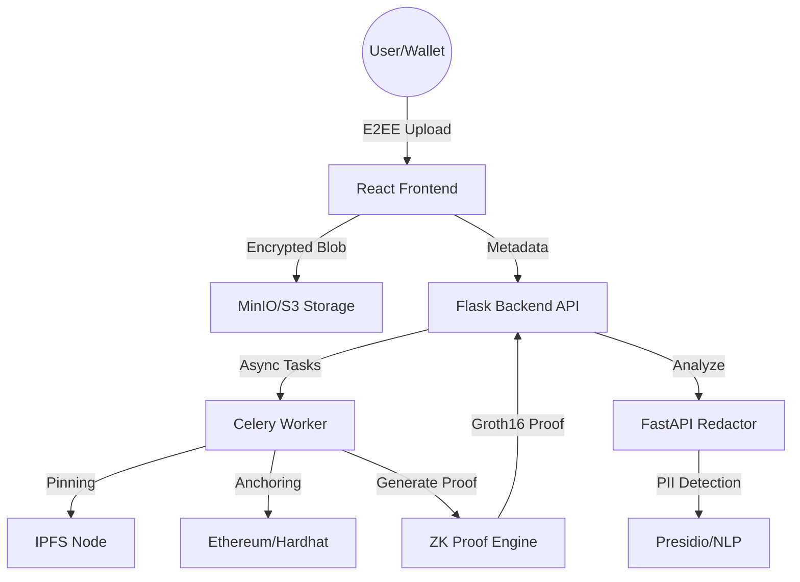

# 🛡️ BlockVault

**Secure. Private. Verifiable.**

BlockVault is a state-of-the-art document management vault that leverages **End-to-End Encryption (E2EE)**, **Blockchain Anchoring**, and **Zero-Knowledge (ZK) Proofs** to ensure your sensitive documents remain private, tamper-proof, and verifiable.

---

## 🚀 Problem Statement
Secure document storage and sharing often suffer from a lack of privacy, data integrity issues, and PII (Personally Identifiable Information) exposure. Centralized solutions expose sensitive data to service providers, and verifying that a document has been correctly redacted without revealing the original sensitive content is a significant cryptographic challenge.

## ✨ About
BlockVault is a privacy-first, decentralized document management system. It provides a "trustless" vault for sensitive documents, allowing organizations to store, share, and redact content while maintaining absolute proof of integrity. By integrating blockchain for anchoring and ZK-proofs for redaction, BlockVault ensures that "what you see is what was anchored," even after sensitive data is removed.

---

## 🏗️ System Architecture

BlockVault is built as a distributed microservices architecture, ensuring modularity and security at every layer.



### Core Components:
- **Frontend (React/Vite):** Handles client-side encryption, ZK proof inputs, and wallet interactions.
- **Backend API (Flask):** Orchestrates the document lifecycle, user management, and workspace RBAC.
- **Redactor Service (FastAPI):** A high-performance microservice dedicated to PII detection and PDF/DOCX manipulation.
- **Crypto Daemon (Rust):** A dedicated service for high-speed cryptographic operations used by the backend.
- **ZK Engine (Circom/SnarkJS):** Generates non-interactive zero-knowledge proofs (zk-SNARKs) for document redactions.

---

## 🔒 Security Architecture

### 1. End-to-End Encryption (V2)
BlockVault implements **V2 Native E2EE**. Documents are encrypted in the browser using **AES-256-GCM**.
- **Key Derivation:** Master keys are derived from user passphrases using **PBKDF2** with a high iteration count.
- **Key Wrapping:** The unique File Encryption Key (FEK) is wrapped using the user's master key and stored alongside the metadata.
- **Zero-Knowledge Storage:** The server never receives the raw passphrase or the unwrapped FEK.

### 2. Zero-Knowledge Redaction
The core innovation of BlockVault is the ability to prove redaction integrity.
- **The Challenge:** How can a third party trust that a redacted PDF is truly a version of the original "Official" document without seeing the sensitive original?
- **The Solution:** We use a Circom circuit that takes the original file (private), the redacted file (public), and a redaction mask (private). It proves that the public redacted file is exactly equal to the private original file except at the masked positions.

---

## 🛠️ Key Features

- 🔐 **End-to-End Encryption:** AES-GCM encryption ensures data is private even if the storage is compromised.
- 🛡️ **Verifiable Redaction:** Generate Groth16 proofs to verify that document modifications are valid.
- ⛓️ **Blockchain Anchoring:** Immutable proof of existence and integrity via smart contracts.
- 🌐 **Hybrid Storage:** Combines high-speed object storage with decentralized IPFS fallback.
- 🏢 **Multi-Tenant Workspaces:** Collaborative environments with granular RBAC (Owner, Admin, Member, Viewer).
- 🕵️ **Advanced Audit Logs:** Detailed, tamper-evident logs for compliance and forensics.
- 💧 **Dynamic Watermarking:** Prevents unauthorized leaks by embedding user identifiers into PDF downloads.

---

## 💻 Tech Stack

| Layer | Technologies |
| :--- | :--- |
| **Frontend** | React 18, TypeScript, Vite, TailwindCSS, TanStack Query, Ethers.js |
| **Backend API** | Python 3.11, Flask, Celery, MongoDB, Redis |
| **Redactor** | FastAPI, PyMuPDF, python-docx, Microsoft Presidio |
| **Cryptography** | Rust (Ring/AEAD), Web Crypto API |
| **Blockchain** | Solidity, Hardhat, OpenZeppelin |
| **Zero-Knowledge** | Circom 2.1, SnarkJS, Groth16 |
| **Infrastructure** | Docker, MinIO, IPFS, Nginx |

---

## ⚙️ Installation & Setup

### Prerequisites
- **Docker & Docker Compose**
- **Node.js** (v18+)
- **Python 3.9+**
- **Circom 2.1.0+** (Optional, for re-compiling circuits)

### Quick Start (Local Development)
1.  **Clone the Repository:**
    ```bash
    git clone https://github.com/ChinmayyK/BlockVault.git
    cd BlockVault
    ```

2.  **Initialize Environment:**
    ```bash
    cp backend/.env.example backend/.env
    cp blockchain/contracts/.env.example blockchain/contracts/.env
    ```

3.  **Start the Full Stack:**
    BlockVault includes a unified management script:
    ```bash
    chmod +x start.sh
    ./start.sh
    ```
    *This script handles dependency installation, ZK artifact preparation, and service orchestration.*

---

## 📖 Usage Guide

### 1. Document Upload
When you upload a file, the frontend generates a random symmetric key, encrypts the file, wraps the key with your passphrase/wallet, and sends the encrypted bundle to BlockVault.

### 2. PII Redaction
1. Open any PDF or DOCX file.
2. The Redactor service automatically highlights potential PII (Names, Emails, SSNs, etc.).
3. Select the entities to redact and click "Apply Redaction".
4. A ZK-proof is generated in the background as a Celery task.

### 3. Verification
Any auditor can download the redacted file and its associated ZK-proof. They can run the verification against the on-chain anchor to confirm the document's authenticity.

---

## 📂 Folder Structure

```text
.
├── backend/            # Flask API, Celery tasks, and core logic
│   ├── blockvault/     # Core Python package
│   └── tests/          # Integration & unit tests
├── frontend/           # React/Vite application
├── services/
│   ├── redactor/       # FastAPI document analysis service
│   └── crypto/         # Rust crypto daemon
├── blockchain/
│   ├── contracts/      # Solidity smart contracts (Hardhat)
│   └── zk/             # Circom circuits and proof scripts
├── deploy/             # Deployment configurations
└── start.sh            # Unified service orchestrator
```

---

## 🔮 Roadmap
- **Recursive Proofs:** Use Plonky2/Boojum to aggregate multiple redaction proofs.
- **Hardware Wallet Integration:** Support for Ledger and Trezor.
- **Advanced OCR:** Integration of Tesseract/PaddleOCR for scanned document redaction.
- **Mobile Vault:** Native iOS/Android app using React Native.

---

## 👤 Author
**Chinmay K.**

---
*Built with ❤️ for a more private and secure web.*
